# RoboHitch

**Learning Visual Affordance from Disordered Keypoints for Hitch Knots Tying**

[Paper](paper/RoboHitch_ICRA2026.pdf) | [Poster](poster/ICRA_RoboHitch_Poster_A0.pdf) | [Video](media/RoboHitch_Video.mp4)

RoboHitch is a learning-based framework for single-arm robotic hitch knot tying. Instead of relying on a fragile ordered rope topology, RoboHitch learns from human demonstrations using unordered 3D rope keypoints and RGB observations. A dynamic graph autoencoder extracts geometric features from disordered rope keypoints, a convolutional autoencoder encodes visual context, and bidirectional cross-attention fuses both modalities to predict pick, rotation, and place affordances.

<p align="center">
  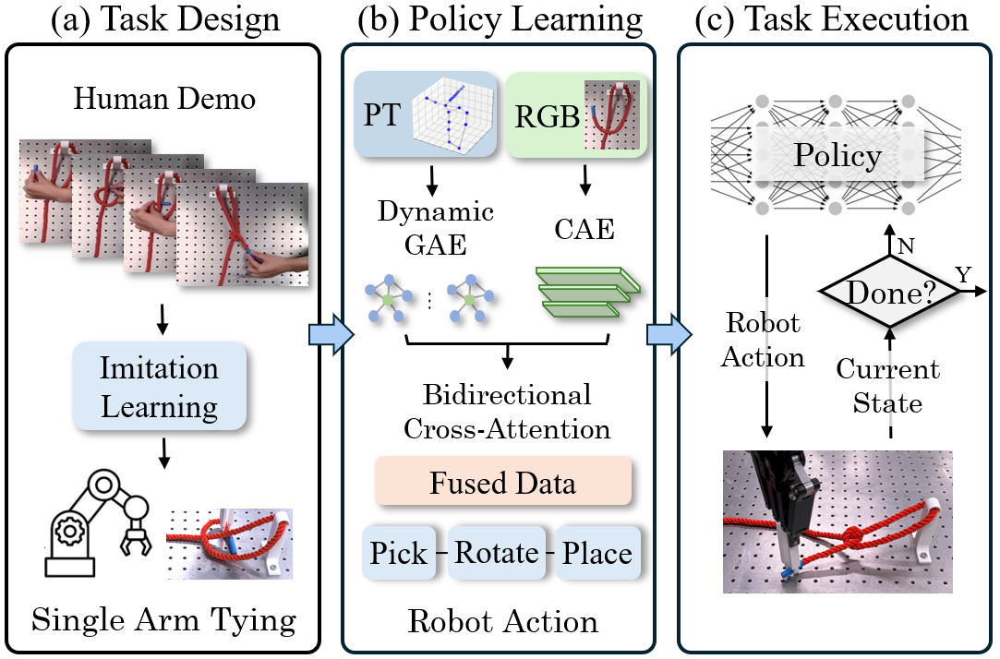
</p>

## Paper and Media

- Paper PDF: [`paper/RoboHitch_ICRA2026.pdf`](paper/RoboHitch_ICRA2026.pdf)
- Poster PDF: [`poster/RoboHitch_ICRA2026_Poster.pdf`](poster/ICRA_RoboHitch_Poster_A0.pdf)
- Demo video: [`media/RoboHitch_Video.mp4`](media/RoboHitch_Video.mp4)

<p align="center">
  <a href="poster/ICRA_RoboHitch_Poster_A0">
    
  </a>
</p>

## Method

RoboHitch addresses hitch knot tying as a closed-loop pick-rotate-place manipulation problem. The central difficulty is that the rope repeatedly bends, crosses itself, and becomes partially occluded during knot formation. Existing knot-tying pipelines often rely on ordered rope keypoints or explicit edge connectivity, but this topological state is fragile under self-occlusion and tracking drift. Instead, RoboHitch learns directly from a multimodal observation:

```text
s_t = f(x_pt, x_rgb)
```

where `x_pt` is an unordered set of 3D rope keypoints and `x_rgb` is the corresponding RGB image. This lets the policy reason about rope geometry without requiring a consistently tracked keypoint sequence.

<p align="center">
  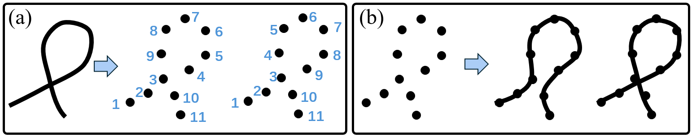
</p>

### Rope State Estimation

RoboHitch extracts rope keypoints from RGB-D observations through point-cloud segmentation and clustering. Since the method does not track point identities across frames, the detected keypoints can appear in any order. For each candidate grasp point, the local rope direction is estimated by applying SVD to its neighboring point cloud. The principal direction gives the gripper an orientation aligned with the local rope segment, improving grasp stability.

### Multimodal Feature Extraction

The framework uses two self-supervised encoders to extract complementary features:

- A dynamic Graph Autoencoder (GAE) encodes the unordered 3D keypoints. At each timestep, a graph is constructed over the rope keypoints, with edges formed according to Euclidean proximity. Its symmetric message passing makes the representation permutation-equivariant, so the learned feature depends on the rope geometry rather than the arbitrary input ordering.
- A Convolutional Autoencoder (CAE) encodes the RGB scene. This visual feature captures global context that is hard to infer from sparse keypoints alone, including rope crossings, the pole location, occlusions, and scene-level spatial relationships.

### Attention-Guided Fusion

Although the dynamic GAE handles the point set permutation problem, unordered keypoints alone can still be topologically ambiguous: different rope configurations may produce similar point sets. RoboHitch resolves this ambiguity by fusing point and image features with bidirectional cross-attention.

- In the geometry-to-scene pathway, keypoint features query RGB features, enriching each rope node with visual context for deciding where to pick.
- In the scene-to-geometry pathway, RGB features query keypoint features, injecting rope geometry into the image space for deciding where to place.

This design avoids naive feature concatenation, which can suffer from spatial-semantic mismatch between sparse 3D keypoints and dense image features.

### Action Affordance Heads

The policy predicts a hierarchical action tuple:

```text
a_t = (i_t, theta_t, p_t)
```

where `i_t` is the selected grasp keypoint, `theta_t` is the in-hand rotation, and `p_t` is the target placement pixel. Instead of independently predicting these values, RoboHitch factorizes the action distribution as:

```text
P(i_t, theta_t, p_t) = P(i_t) P(theta_t | i_t) P(p_t | i_t, theta_t)
```

The Pick Head predicts a probability distribution over rope keypoints. The Rotation Head predicts the gripper rotation conditioned on the selected keypoint. The Place Head decodes a pixel-wise affordance heatmap conditioned on both the pick point and rotation. During execution, the robot repeatedly observes the scene, predicts the action tuple, executes the Cartesian motion, and stops when the learned termination classifier detects task completion.

<p align="center">
  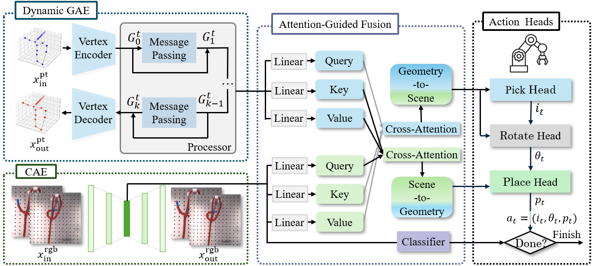
</p>

## Demonstrations and Hardware

The model is trained from 100 human demonstration videos. MediaPipe is used to label pick points, in-hand rotations, and placement targets from human hand motions.

<p align="center">
  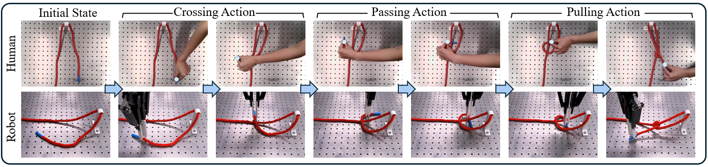
</p>

The real-robot setup uses a UR10 manipulator, a Robotiq 2F-140 gripper, and a wrist-mounted Intel RealSense L515 RGB-D camera.

<p align="center">
  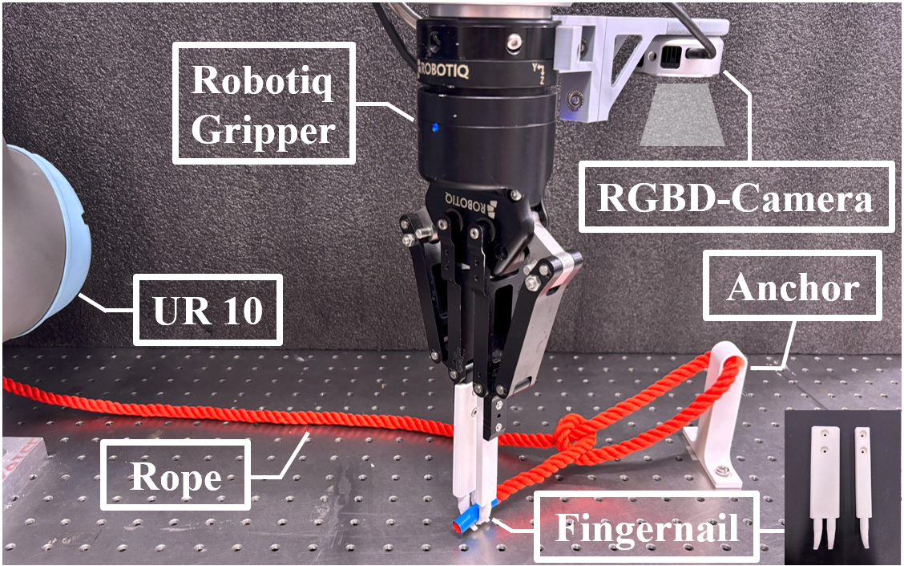
</p>

## Results

RoboHitch achieves an overall success rate of **84%** on real-world hitch knot tying with the trained rope setup, completing **42 out of 50** trials.

| Method | Arm | Success rate |
| --- | --- | --- |
| Dinkel et al. | Single | 50% |
| Nair et al. | Single | 38% |
| Priya et al. | Single | 66% |
| Pathak et al. | Single | 60% |
| **RoboHitch** | **Single** | **84%** |

Generalization was evaluated across background, rope diameter, and rope material changes.

| Scenario | Condition | Success |
| --- | --- | --- |
| S1 | Nylon, 10 mm, seen background | 5/5 |
| S2 | Nylon, 10 mm, unseen background | 4/5 |
| S3 | Nylon, 14 mm, seen background | 3/5 |
| S4 | Polypropylene, 10 mm | 0/5 |

<p align="center">
  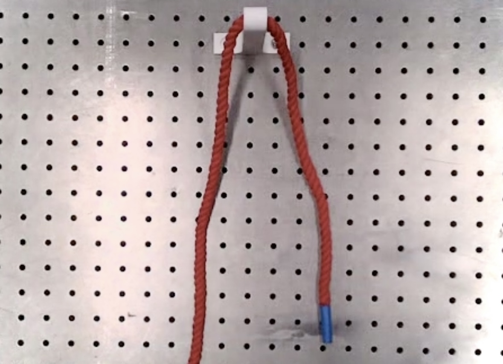
  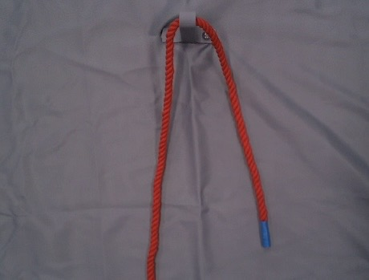
  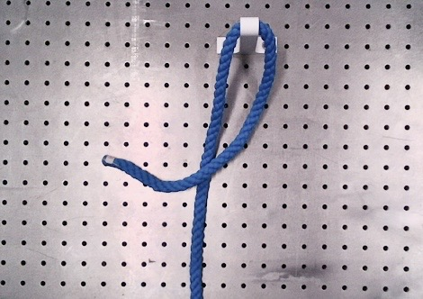
  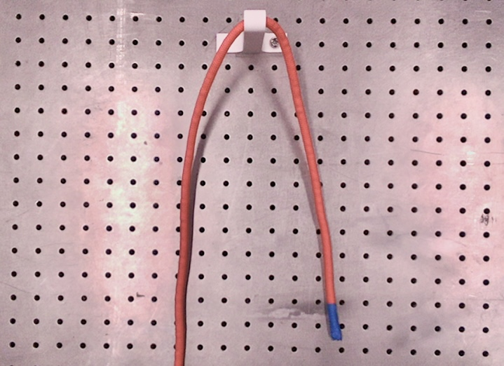
</p>

## Affordance Visualization

The fused RGB and point-keypoint representation produces grasp and placement affordances that are more useful for the sequential hitch-tying task than single-modality variants.

<p align="center">
  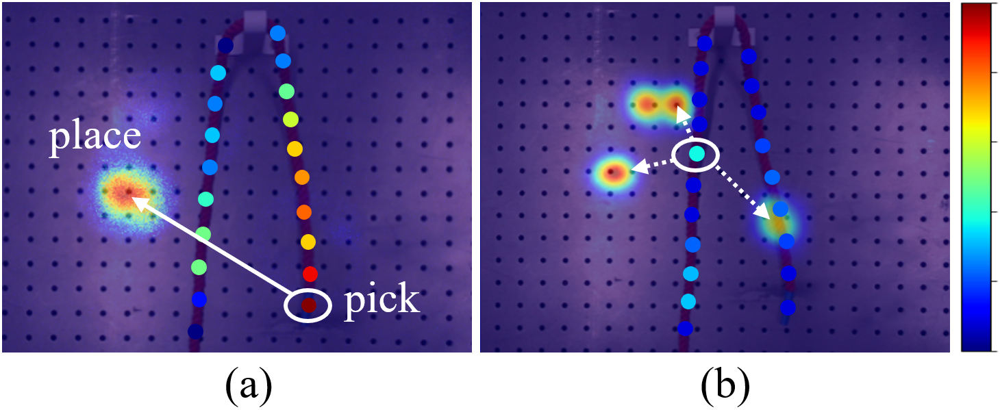
</p>

<p align="center">
  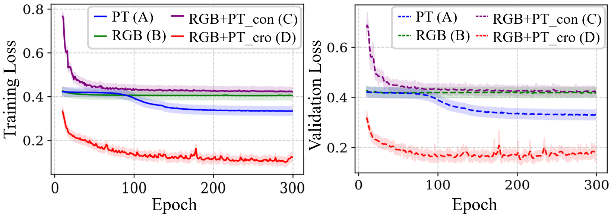
</p>

## Repository Structure

```text
RobotHitch_github/
  README.md
  paper/
    RoboHitch_ICRA2026.pdf
  /
    ICRA_RoboHitch__A0.pdf
  media/
    RoboHitch_Video.mp4
  assets/
    images/
      overview.png
      framework.png
      problem.png
      demonstration.png
      hardware_setup.png
      affordance_visualization.png
      ablation_loss.png
      poster_preview.png
      scenario_seen.jpg
      scenario_unseen_bg.jpg
      scenario_thick_rope.jpg
      scenario_stiff_rope.jpg
```

## Citation

```bibtex
@inproceedings{zuo2026robohitch,
  title={RoboHitch: Learning Visual Affordance from Disordered Keypoints for Hitch Knots Tying},
  author={Zuo, Jiahui and Zhang, Boyang and Zhang, Fumin},
  booktitle={IEEE International Conference on Robotics and Automation (ICRA)},
  year={2026}
}
```
